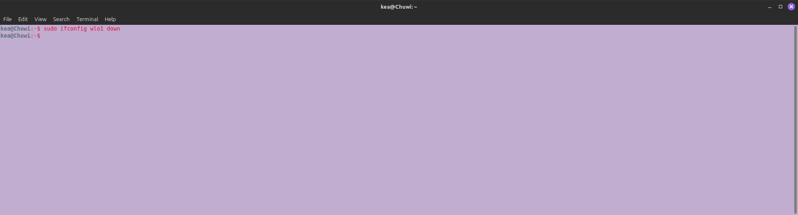
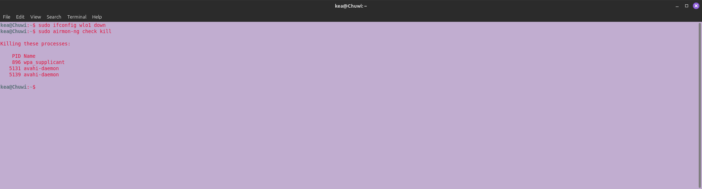
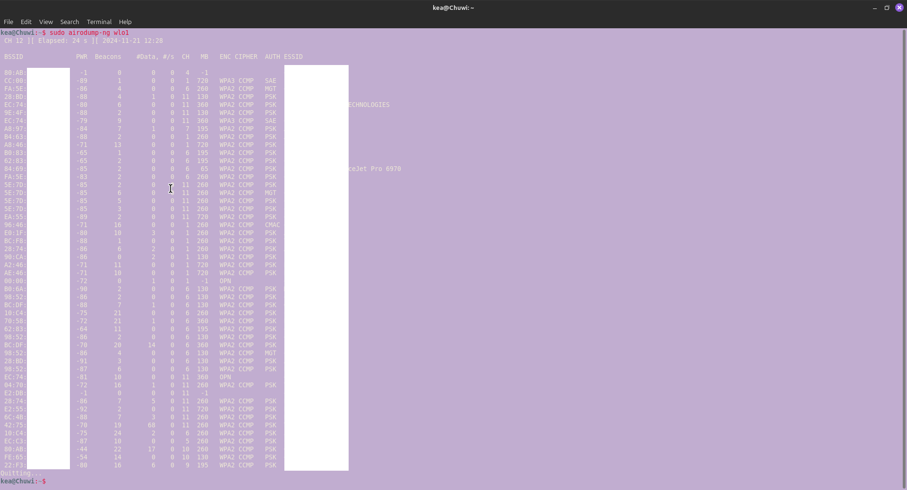
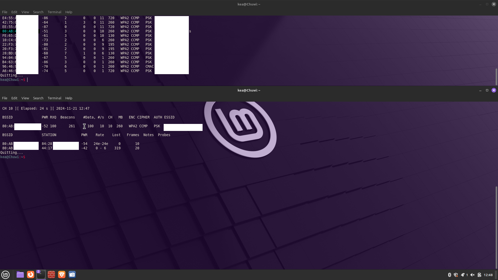
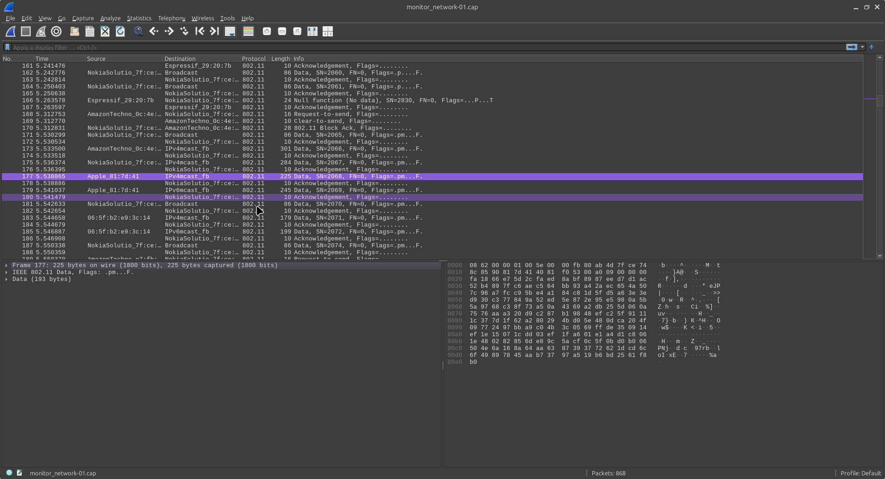

# Lab 1: Setting Up a Monitoring Device and Analyzing Packets

In this first guide, we’ll turn your device into a monitoring station, using the Terminal, to capture Wi-Fi traffic and analyze the data using Wireshark. Follow these steps carefully. They will be implemented throughout the series:

---

## Step 1: Enable Monitor Mode
Monitor mode allows your network interface to capture packets without connecting to a specific network. Here's how to set it up:

1. **Disable the Network Interface**
   ```bash
   sudo ifconfig <your-interface-name> down
   ```


2. **Kill Interfering Processes**
   Run the following command to stop any processes that might interfere with your work:
   ```bash
   sudo airmon-ng check kill
   ```
   *Note: Your Wi-Fi connection will automatically be disabled.*

   

4. **Enable Monitor Mode**
   ```bash
   sudo iwconfig <your-interface-name> mode monitor
   ```

5. **Bring the Interface Back Online**
   ```bash
   sudo ifconfig <your-interface-name> up
   ```

---

## Step 2: Discover Nearby Networks
Use the **Aircrack-ng suite** to scan for Wi-Fi networks in your area:
   ```bash
   sudo airodump-ng <your-interface-name>
   ```
   


### Understanding the Output
When scanning, you'll see a list of networks and details about them:
- **ESSID**: Network name
- **BSSID**: MAC address of the network
- **Beacons**: Broadcast signals from the router
- **ENC**: Encryption type (e.g., WPA2, WEP)

Identify the network you want to monitor and take note of its **BSSID** and channel number.

---

## Step 3: Capture Network Packets
To target a specific network, run:
   ```bash
   sudo airodump-ng --bssid <target-BSSID> --channel <target-channel-number> --write <file-name> <your-interface-name>
  ```
   


### What You’ll See
This command captures packets from the target network, including information about connected devices:
- **BSSID**: MAC address of the network
- **Station**: MAC addresses of connected devices
- **PWR**: Signal strength
- **Rate**: Data transmission rate
- **Lost**: Number of lost packets
- **Frames**: Number of captured packets
- **Probe**: Devices searching for nearby networks

The captured data is saved to the file specified in the `--write` argument.

---

## Step 4: Analyze Captured Packets with Wireshark
1. Open the Wireshark application:
   ```bash
   wireshark
   ```

2. Navigate to your saved file:
   - Go to **File > Open**.
   - Select the file you saved earlier.

### Example Output
If the network is WPA2-protected (as in this example), the captured packets will be encrypted and not immediately readable. Further steps (covered in future parts) will explain how to decrypt these packets.



---

## Step 5: Restore Your Device to Managed Mode
Once you've finished sniffing packets, you’ll need to return your device to managed mode to reconnect to the internet. Here's how:

1. **Disable Monitor Mode**
   ```bash
   sudo ifconfig <your-interface-name> down
   sudo iwconfig <your-interface-name> mode managed
   sudo ifconfig <your-interface-name> up
   ```

2. **Restart Network Services**
   If your Wi-Fi isn’t reconnecting, restart the network services:
   ```bash
   sudo systemctl restart NetworkManager
   ```

Your device should now reconnect to the internet as usual.

---

### Skills and Knowledge Gained
 - Set up a network monitoring device
 - Captured and analyzed packets in `Wireshark`
